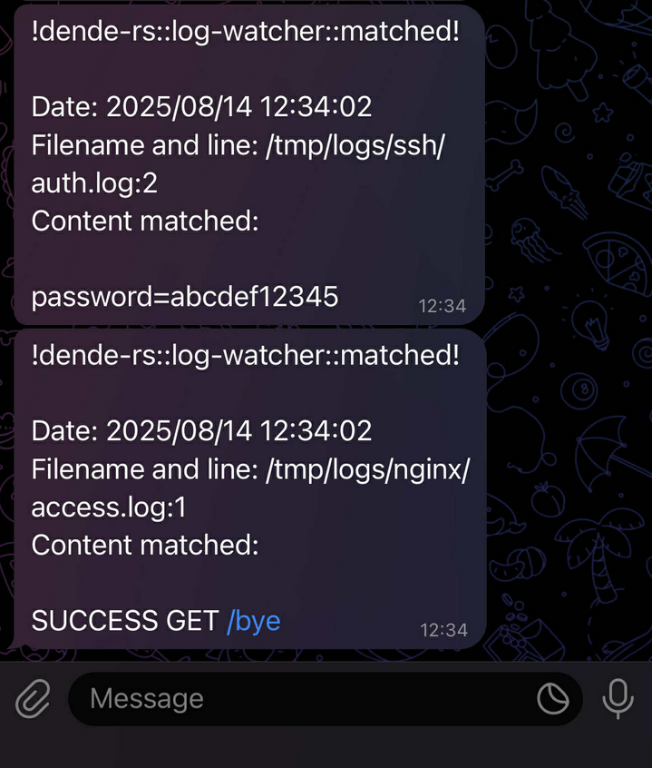
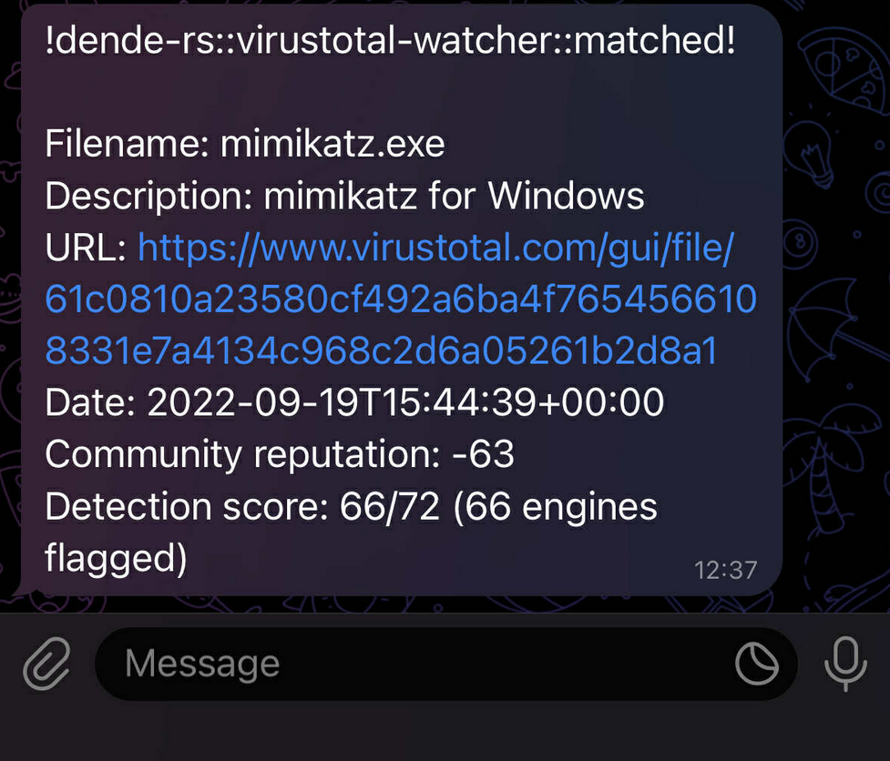
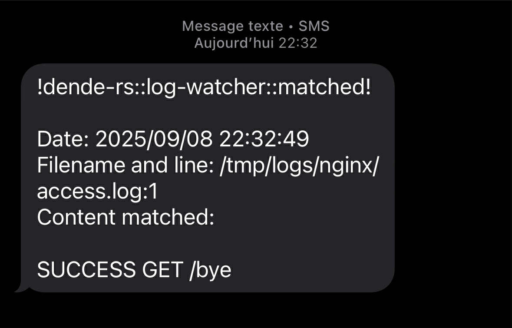

    <picture>
        
    </picture>
     
    <strong style="font-size: large;">dende-rs (デンデ, Dende)</strong>

Like Dende in DBZ watching over Earth, `dende-rs` watches your logs in real time and alerts the right people as soon as a line matches a string or regex. It can also run a dedicated VirusTotal watch job that polls the VT API for your payload’s hash and notifies you the instant it’s published. Configure sinks (console and/or Telegram) and run multiple jobs via CLI flags or a YAML file. The notifier layer is modular (sinks), so you can easily plug in new channels, e.g., Slack, email, SMS and without touching the core watcher. If you need more information how to add new notifier or how to use `dende-rs` please check [help page](HELP.md).

> It helps you monitor text streams or files, match patterns, and trigger alerts through multiple channels.

- [HELP.md](HELP.md) - How to compile it? How to install it? How to use it? How to add another API notifier?
- [CHANGELOG.md](CHANGELOG.md) - A record of all significant version changes
- [ROADMAP.md](ROADMAP.md) - List of planned evolutions
- [EXAMPLES](#examples) - Notifications examples for `log-watcher`, `virustotal-watcher`, `Telegram` and `SMS`

---

## Features

- **Flexible pattern matching**:
  - Match using *plain strings*
  - Match using *regular expressions (regex)*
  - Match against *VirusTotal* lookups
- **Multiple output sinks** to notify you when something is found:
  - Both *free* and *paid* integrations are supported

---

## Notification Sinks

| Sink       | Type    | Notes                          |
|------------|---------|--------------------------------|
| *Console (CLI)* | **Free**    | Print alerts directly to your terminal |
| *Telegram*      | **Free**    | Send alerts to a [Telegram](https://core.telegram.org/bots/api) user from your bot |
| *Textbelt (SMS)* | **Paid**    | Send alerts as SMS using [Textbelt](https://textbelt.com/) |

---

## Example Use Cases

- Watch application logs and send an alert if a critical error appears
- Monitor file output for *regex patterns* (e.g. IP addresses, hashes)
- Automatically check indicators against *VirusTotal*
- Get notifications in your preferred channel (console, Telegram, email, SMS with textbelt)

## Examples 

<table>
  <tr>
    <td align="center" width="50%">
       
      <b>Log watcher - Telegram</b>
    </td>
    <td align="center" width="50%">
       
      <b>VirusTotal watcher - Telegram</b>
    </td>
  </tr>
  <tr>
    <td align="center" width="50%">
       
      <b>Log watcher - SMS with textbelt API</b>
    </td>
  </tr>
</table>

# Special thanks to 

